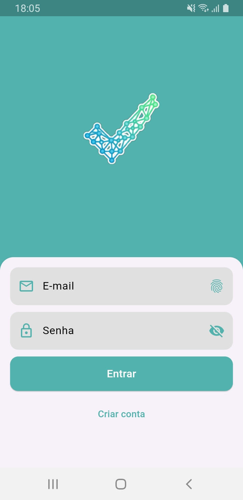
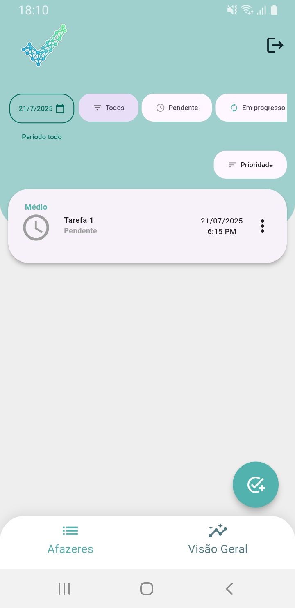

# 📲 Nome do Aplicativo

Breve descrição do aplicativo. Explique em 1 ou 2 frases o que ele faz.

---

## 📱 Download e Instalação

### 🔗 Link para Download do APK

Você pode baixar a versão mais recente do aplicativo aqui:

👉 [Download APK](app-release.apk)

### 📱 Versão mínima do Android suportada

- Android 5.0 (API 21) ou superior

---

## 🔐 Permissões necessárias

O aplicativo solicita as seguintes permissões:

- `INTERNET`: permite que o app acesse a internet.
- `POST_NOTIFICATIONS`: necessária para exibir notificações no Android 13 (API 33) ou superior.
- `SCHEDULE_EXACT_ALARM`: usada para agendar alarmes com horário exato.
- `RECEIVE_BOOT_COMPLETED`: permite que o app seja iniciado após o boot do dispositivo (reagendamento de alarmes/notificações).
- `WAKE_LOCK`: impede que o dispositivo entre em modo de suspensão durante certas operações.
- `READ_MEDIA_IMAGES`: leitura de imagens da galeria (para Android 13+).
- `READ_EXTERNAL_STORAGE`: leitura de arquivos externos em versões mais antigas do Android.

> ⚠️ As permissões são solicitadas em tempo de execução conforme a necessidade, respeitando as políticas de privacidade do Android.

---

## ⚙️ Instruções de instalação

1. Baixe o arquivo `.apk` através do link acima.
2. No seu celular Android, vá em **Configurações > Segurança** e ative **Fontes desconhecidas** (se necessário).
3. Abra o arquivo APK baixado e siga as instruções para instalar.
4. Pronto! Agora é só usar o app.

---

## 🖼️ Screenshots

Abaixo estão algumas capturas de tela do aplicativo:

| Tela de Login | Tela Principal |
|---------------|----------------|
|  |  |

> Coloque as imagens na pasta `screenshots/` no diretório raiz do projeto para que apareçam corretamente.

---

## 🚀 Tecnologias utilizadas

- **Flutter** (SDK principal)
- **Dart** (linguagem de programação)
- **Arquitetura**: Clean Architecture com `flutter_modular`, `flutter_triple` e `provider`
- **Autenticação e Backend**: `supabase_flutter`,
- **Persistência local**: `sqflite`, `shared_preferences`, `flutter_secure_storage`
- **Notificações**: `flutter_local_notifications`, `workmanager`
- **Permissões**: `permission_handler`
- **Gráficos e animações**: `fl_chart`, `shimmer`
- **Manipulação de imagens**: `image_picker`, `native_image_cropper`, `crop_image`
- **Outros utilitários**: `intl`, `http`, `path_provider`, `timezone`, `android_intent_plus`, `local_auth`, `envied`

---
